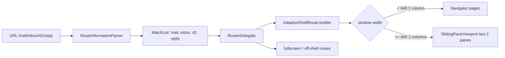

# xue_hua_adaptive_sliding_layout

[中文文档](README.zh-CN.md) · **[Live demo](https://matkurban.github.io/xue_hua_adaptive_sliding_layout/)**

Declarative adaptive routing for Flutter. **One route table** maps a URL to a page stack and a 1- or 2-column sliding layout. Call sites look like `Navigator`: `AdaptiveRouter.of(context).pushNamed(...)`.

It does **not** depend on `go_router`. The host holds the `AdaptiveRouter` instance — no service locator. Extra dependencies: `signals_flutter`, `material_ui`.

- [60-second start](#60-second-start)
- [URL → stack → panes](#url--stack--panes)
- [Route table](#route-table)
- [Navigation verbs](#navigation-verbs)
- [Reading state](#reading-state)
- [Customizing the UI](#customizing-the-ui)
- [Layout without a router](#layout-without-a-router)
- [Example scenarios](#example-scenarios)
- [Migrating from 2.x](#migrating-from-2x)
- [Migrating from go_router](#migrating-from-go_router)
- [Caveats](#caveats)

## 60-second start

```dart
final router = AdaptiveRouter(
  initialLocation: '/mail',
  routes: [
    AdaptiveShellRoute(
      builder: (context, shell, child) {
        return Scaffold(
          body: child,
          bottomNavigationBar: shell.isCompact
              ? NavigationBar(
                  selectedIndex: shell.currentIndex,
                  onDestinationSelected: (i) => shell.goBranch(i),
                  destinations: const [
                    NavigationDestination(icon: Icon(Icons.mail), label: 'Mail'),
                    NavigationDestination(icon: Icon(Icons.people), label: 'Contacts'),
                  ],
                )
              : null,
        );
      },
      branches: [
        AdaptiveBranch(routes: [
          AdaptiveRoute(
            path: '/mail',
            title: (_) => 'Mail',
            builder: (context, state) => const MailPage(),
            routes: [
              AdaptiveRoute(
                path: ':folder',
                builder: (context, state) =>
                    FolderPage(folder: state.pathParameters['folder']!),
              ),
            ],
          ),
        ]),
        AdaptiveBranch(routes: [
          AdaptiveRoute(
            path: '/contacts',
            builder: (context, state) => const ContactsPage(),
          ),
        ]),
      ],
    ),
  ],
);

MaterialApp.router(routerConfig: router);
```

From a page:

```dart
final router = AdaptiveRouter.of(context);
router.pushNamed('/mail/inbox');
router.pushNamed(
  router.namedLocation('thread', pathParameters: {'folder': 'inbox', 'threadId': '42'}),
  arguments: thread,
);
router.pop();
```

Copy the full table from [`example/lib/router.dart`](example/lib/router.dart).

## URL → stack → panes



A location such as `/mail/inbox/42/reply` walks the route tree and produces a list of matches. That list **is** the page stack. Below `expandedMinWidth` (default 840) it is a classic `Navigator`. At or above it, the last two matches sit side by side in [`SlidingPaneViewport`](lib/src/layout/sliding_pane_viewport.dart); deeper pages slide older ones off to the left. `fullscreen: true` and `fullscreenDialog: true` matches stack on the **root** Navigator (login, photo, compose dialogs).

Browser back, deep links, and refresh all change the location and take the same path. Web uses the default **hash** strategy (`/#/mail/inbox/42`), so GitHub Pages needs no 404 fallback.

## Route table

| Type | Role |
| --- | --- |
| [`AdaptiveRouter`](lib/src/router/adaptive_router.dart) | `RouterConfig<AdaptiveRouteMatchList>`. Verbs + `namedLocation` / `refresh`. Signals: `location`, `matches`, `currentBranch`. `of` / `maybeOf`. |
| [`AdaptiveRoute`](lib/src/router/route.dart) | One page. `path`, optional `name`, `builder`, `title`, `fullscreen`, `fullscreenDialog`, `hidesBottomBarWhenPushed`, `opaque`, `barrierColor`, `barrierDismissible`, `transitionsBuilder`, `redirect`, `onExit`, nested `routes`. Child paths are relative; `:param` matches go_router. First match wins. |
| [`AdaptiveShellRoute`](lib/src/router/route.dart) | Tabs + adaptive chrome. One per tree, top-level only. `builder(context, shell, child)`, `branches`, `breakpoints`, sash / breadcrumbs, plus [UI knobs](#customizing-the-ui). |
| [`AdaptiveBranch`](lib/src/router/route.dart) | One tab. `routes`, optional `initialLocation` / `placeholder`. |
| [`AdaptiveRouteState`](lib/src/router/route_state.dart) | Builder argument, also `AdaptiveRouteState.of(context)`: `uri`, `matchedLocation`, `fullPath`, `name`, `pathParameters`, `queryParameters`, `arguments`, `error`, `pageKey`. |
| [`AdaptiveShellState`](lib/src/router/route_state.dart) | Shell builder argument: `currentIndex`, width / breakpoints, `leftPaneFraction`, `goBranch`. |
| [`LayoutBreakpoints`](lib/src/layout/layout_breakpoints.dart) | `const` class, defaults `compactMaxWidth: 600`, `expandedMinWidth: 840`. |

`builder` + `transitionsBuilder` replace go_router's `pageBuilder` because wide panes need a `Widget`, not a `Page`.

Top-level `redirect` and per-route `redirect` may return a new location (`FutureOr<String?>`). Loops stop after `redirectLimit` (5) and hit `errorBuilder`.

## Navigation verbs

All names and signatures match [`NavigatorState`](https://api.flutter.dev/flutter/widgets/NavigatorState-class.html). `routeName` is a location. There is no non-named `push(Route)` — every page must be in the table so the URL can express it.

| Call | Compact (1 column) | Expanded (2 columns) |
| --- | --- | --- |
| `pushNamed` | Push onto the branch `Navigator`, or overlay the root if `fullscreen` / off-shell. Same-branch prefix extends the stack (`/mail` → `/mail/inbox/42` can slide in two panes). Same-branch non-prefix appends the leaf (`/mail/inbox/41` → `/mail/inbox/42` yields `[mail, inbox, 41, 42]`). Other branch: switch tab and rebuild that stack from the URL. |
| `pushReplacementNamed` | Replace stack top. Same-level swap; the right pane updates in place. |
| `pushNamedAndRemoveUntil` | Pop while the predicate is false, then `pushNamed`. `(_) => false` rebuilds from the URL (deep link, login return, reset tab). |
| `popAndPushNamed` | `pop` then `pushNamed`. |
| `pop` | Pop immediately. **Does not** call `onExit`. |
| `maybePop` | Asks the top route's `onExit`. AppBar back, system back, browser back, and Escape use this. |
| `popUntil` | Pop until the predicate is true, not past the branch root. |
| `canPop` | Overlay present, or current branch depth > 1. |

Tab switches are not a Navigator verb. Use `AdaptiveShellState.goBranch(index, {initialLocation})`. Internally that is `pushNamedAndRemoveUntil` to the branch's last location (or `initialLocation`). Tapping the **current** tab with `initialLocation: true` returns to the branch root — see [`example/lib/shell/app_shell.dart`](example/lib/shell/app_shell.dart).

Helpers: `namedLocation(name, pathParameters:, queryParameters:)` builds a location for the `*Named` verbs; `refresh()` re-runs redirect after auth changes.

`pushNamed` returns a `Future` completed by `pop(result)`.

## Reading state

```dart
AdaptiveRouter.of(context).location.value;          // '/mail/inbox/42'
AdaptiveRouteState.of(context).pathParameters;      // {'folder': 'inbox', ...}
AdaptivePaneScope.maybeOf(context)?.title.value = subject; // breadcrumbs
AdaptiveShellScope.maybeOf(context)?.isExpanded;
```

[`AdaptivePaneScope.maybeOf`](lib/src/layout/pane_scope.dart) is non-null only inside a two-column pane. Use it instead of 2.x `inSlidingWindow` / `SlidingPageTitle`. Async titles: write `title.value` when the subject arrives — the package no longer walks the element tree for `AppBar.title`.

Subscribe in UI with `SignalBuilder` (see `signals_flutter`).

To draw titles in **your** chrome instead of the built-in strip, read `AdaptiveRouter.of(context).matches.value.branchMatches` (each match has a `title` signal and `name`).

## Customizing the UI

Use **builders** to replace structure, **value parameters** to tweak numbers. Defaults match the 3.0 first release. Theme colors still come from `Theme.of(context)`. 1-column page transitions use Flutter's `ThemeData.pageTransitionsTheme`.

### Viewport (`SlidingPaneViewport` / `AdaptiveShellRoute`)

| Parameter | Default | Role |
| --- | --- | --- |
| `slideDuration` | 280ms | Column slide |
| `slideCurve` | `Curves.easeOutCubic` | Column slide |
| `paneBuilder` | 2-col card / 1-col flat | Wrap each column. `index == panes.length` is the empty right slot |
| `resizeHandleBuilder` | 2px `outline` line | Visual only; hit target stays 44px |
| `placeholder` | outline icon | Shell-level empty right pane; `AdaptiveBranch.placeholder` wins if set |

### Breadcrumbs

| Parameter | Default | Role |
| --- | --- | --- |
| `height` | 36 | Strip height |
| `padding` | horizontal 12 | Strip padding |
| `backgroundColor` | `surfaceContainerLow` | Strip color |
| `itemBuilder` | InkWell + Text | One crumb |
| `separatorBuilder` | chevron | Between crumbs |
| `AdaptiveShellRoute.breadcrumbsBuilder` | `AdaptiveBreadcrumbs` | Replace the whole strip (`showBreadcrumbs` still gates it) |
| `escapePops` | true | Escape calls `maybePop` |

On medium / expanded, nested pages keep the host chrome (same as go_router `ShellRoute`). On compact, pages below the branch root hide the bottom bar by default (`hidesBottomBarWhenPushed`; set `false` to keep it). `fullscreen` / `fullscreenDialog` cover the shell at every width.

### Overlay routes (`AdaptiveRoute`)

| Parameter | Default | Role |
| --- | --- | --- |
| `hidesBottomBarWhenPushed` | true | Compact only: the pushed page covers the host bottom bar (same name as iOS). Two panes on desktop are untouched |
| `fullscreen` | false | Root Navigator at every width, normal transition (= go_router `parentNavigatorKey: rootNavigatorKey`) |
| `fullscreenDialog` | false | Root Navigator at every width as a Material fullscreen dialog (slide up, close icon) |
| `opaque` | true | With `transitionsBuilder`: transparent photo viewer |
| `barrierColor` | null | With `transitionsBuilder` |
| `barrierDismissible` | false | Tap the barrier to pop |

See [`example/lib/router.dart`](example/lib/router.dart) for card/flat `paneBuilder`, a 40px breadcrumb strip, and a translucent `/photo/:id` overlay.

## Layout without a router

[`SlidingPaneViewport`](lib/src/layout/sliding_pane_viewport.dart), [`SlidingPane`](lib/src/layout/pane_scope.dart), and [`AdaptiveBreadcrumbs`](lib/src/layout/breadcrumbs.dart) stay public if you only want the sliding columns.

Breakpoints (window width, not device type):

| Width | Band | Visible columns |
| --- | --- | --- |
| `< compactMaxWidth` (600) | compact | 1 — `Navigator` (full-screen stack) |
| `600–839` | medium | 1 — same `Navigator`; host uses `shell.isMedium` for chrome |
| `≥ expandedMinWidth` (840) | expanded | 2 — last two panes + optional sash |

`ponytail:` the viewport is 1 or 2 columns. Three-plus columns would change `visibleColumnCount` and teach `SlidingPaneViewport` to lay out N panes.

## Example scenarios

[`example/`](example/) is the integration template. On the web demo, the top bar pins Phone 412 / Foldable 700 / Tablet 1024 / Desktop so you do not have to resize the window.

| Area | What it shows | Files |
| --- | --- | --- |
| Mail | 4-deep stack, sash, breadcrumbs `popUntil`, `pushReplacementNamed` folder swap, `pushNamed` vs stack-on-top, async pane title, `arguments` + `?ref=`, reply keep-alive, fullscreen photo | [`features/mail`](example/lib/features/mail/mail_pages.dart) |
| Contacts | `?q=` as URL state, `namedLocation`, `await pushNamed<bool>` + `pop(true)`, `onExit` dialog (`maybePop` vs `pop`), avatar → photo | [`features/contacts`](example/lib/features/contacts/contact_pages.dart) |
| Settings | `redirect` to `/login?from=`, `pushNamedAndRemoveUntil` return, `refresh()` on sign-out, theme / sash, `errorBuilder` 404 | [`features/settings`](example/lib/features/settings/settings_pages.dart) |
| Playground | Every Navigator verb, no-context `router.pushNamed`, custom `transitionsBuilder`, `showDialog` / sheet `useRootNavigator` contrast, Escape | [`features/playground`](example/lib/features/playground/playground_page.dart) |
| Onboarding / auth | App starts on `/onboarding` (log in / register / enter home), login ↔ register via `pushReplacementNamed`, `?from=` return, `pushNamedAndRemoveUntil` into the shell | [`features/auth`](example/lib/features/auth/auth_pages.dart) |
| Shell / frame | compact `NavigationBar` vs rail, width presets | [`app_shell.dart`](example/lib/shell/app_shell.dart), [`demo_frame.dart`](example/lib/frame/demo_frame.dart) |

```bash
cd example && flutter run -d chrome
cd example && flutter test
```

## Migrating from 2.x

| 2.x | 3.x |
| --- | --- |
| `SlidingShell` + per-tab `MultiColumnScaffold` + `AdaptiveNavigator` + 9-method fallback | one `AdaptiveRouter` + `MaterialApp.router` |
| `handlesRoute` / `buildPage` / `resolveTitle` | `AdaptiveRoute` in the table |
| `from:` / `openAfter` / `openSecondary` | URL is the stack (`pushNamed` prefix vs append) |
| `extra` | `arguments` |
| `inSlidingWindow(context)` | `AdaptivePaneScope.maybeOf(context) != null` |
| `SlidingPageTitle.report` | `AdaptivePaneScope.maybeOf(context)?.title.value = …` |
| `SlidingActions.pop` | `AdaptiveRouter.of(context).maybePop()` |

There is no compatibility shim. See [CHANGELOG](CHANGELOG.md).

## Migrating from go_router

| go_router | this package |
| --- | --- |
| `GoRoute` | `AdaptiveRoute` |
| `StatefulShellRoute.indexedStack` | `AdaptiveShellRoute` + `AdaptiveBranch` |
| `context.go(loc)` | `router.pushNamedAndRemoveUntil(loc, (_) => false)` |
| `context.push(loc)` | `router.pushNamed(loc)` |
| `extra` | `arguments` |
| `GoRouterState` | `AdaptiveRouteState` |
| `pageBuilder` | `builder` + optional `transitionsBuilder` |
| `context.go` / `context.pop` extensions | `AdaptiveRouter.of(context)` only |

## Caveats

- Crossing the 840 breakpoint **rebuilds** page `State` (Navigator tree ↔ viewport tree). Keep durable state in the route URL, a signal, or a host store.
- Pane overlays are **clipped**. Dialogs, menus, and sheets inside a column should use the root overlay: `useRootNavigator: AdaptivePaneScope.maybeOf(context) != null`.
- `onExit` runs for `maybePop`, system back, and browser back. `pop` / `pushReplacementNamed` / `pushNamedAndRemoveUntil` run immediately, like `Navigator`.
- Web keeps hash URLs. The platform's initial route wins over `initialLocation` when it is not `/`.
- One `AdaptiveShellRoute`, top-level only. No nested shells, no `restorable*`, no `context.pushNamed` extensions.

## Tests

```bash
flutter analyze && flutter test
cd example && flutter analyze && flutter test
```
